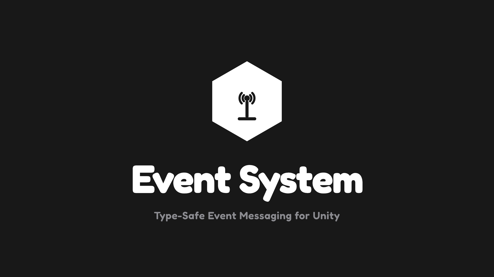

# EventSystem

Enum-keyed publish/subscribe event system for Unity, with type-safe data payloads.



## Overview

EventSystem is a lightweight, code-first event manager for Unity. Every event is a member of a
single `EventTypes` enum, and can either carry no data or a single typed payload (`IntArgs`,
`BoolArgs`, `Vector3Args`, or any custom class you generate). There's no ScriptableObject and no
Inspector setup — everything is registered, invoked, and unregistered directly in code.

## Features

- Static `EventManager` API: `RegisterEvent`, `UnregisterEvent`, `InvokeEvent` - for both
  parameterless and data-carrying events
- A single `EventTypes` enum as the source of truth for every event name in the project
- 8 built-in payload types: `IntArgs`, `FloatArgs`, `BoolArgs`, `StringArgs`, `GameObjectArgs`,
  `Vector2Args`, `Vector3Args`, `AudioArgs`
- `Create > Event System > Args Script` menu item generates a ready-to-edit custom payload class
  (e.g. `EnemyArgs`, `PanelArgs`) from a template
- Pure C# core with no coupling to any particular gameplay system - a publisher and its listeners
  never reference each other

## Setup

### Requirements

- Unity 2021.3 LTS or newer

### Installation

Clone or download this repository, then copy the `EventSystem` folder into your project's
`Assets/Scripts/` (or anywhere under `Assets/`). It's self-contained via its own assembly
definitions - no other setup is required.

## Quick Start

**1. Add your event's name to `EventTypes`:**

```csharp
public enum EventTypes
{
    PlayerDead,
}
```

**2. Register a listener, e.g. in `OnEnable`/`OnDisable`:**

```csharp
private void OnEnable()  => EventManager.RegisterEvent(EventTypes.PlayerDead, OnPlayerDead);
private void OnDisable() => EventManager.UnregisterEvent(EventTypes.PlayerDead, OnPlayerDead);

private void OnPlayerDead() => Debug.Log("Player dead.");
```

**3. Invoke it from anywhere:**

```csharp
EventManager.InvokeEvent(EventTypes.PlayerDead);
```

**If the event needs to carry data**, use one of the built-in `Args` types (or generate your own
via `Create > Event System > Args Script`):

```csharp
private void OnEnable()
{
    EventManager.RegisterEvent<BoolArgs>(EventTypes.InteractableUndetected, OnInteractableUndetected);
}

private void OnDisable()
{
    EventManager.UnregisterEvent<BoolArgs>(EventTypes.InteractableUndetected, OnInteractableUndetected);
}

private void OnInteractableUndetected(BoolArgs args)
{
    Debug.Log($"Interactable Undetected: {args.Value}");
}

// Elsewhere:
EventManager.InvokeEvent(EventTypes.InteractableUndetected, new BoolArgs(true));
```

## License

[MIT License](LICENSE)
